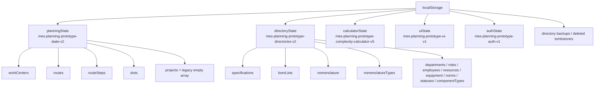
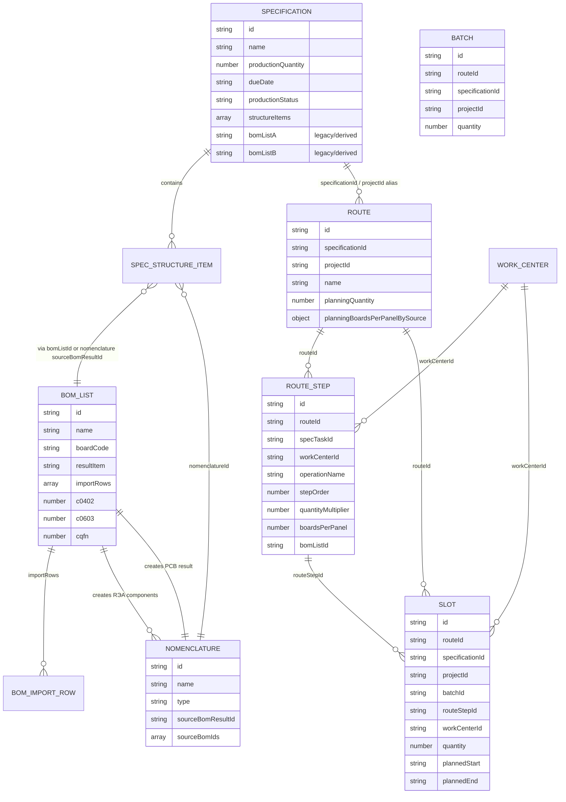
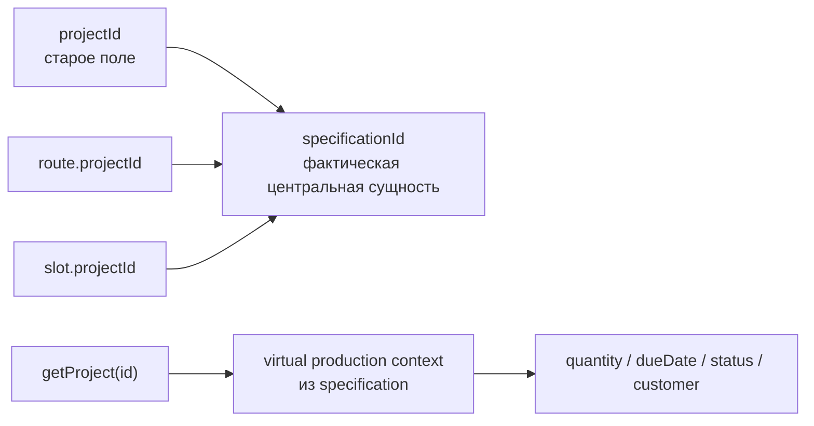
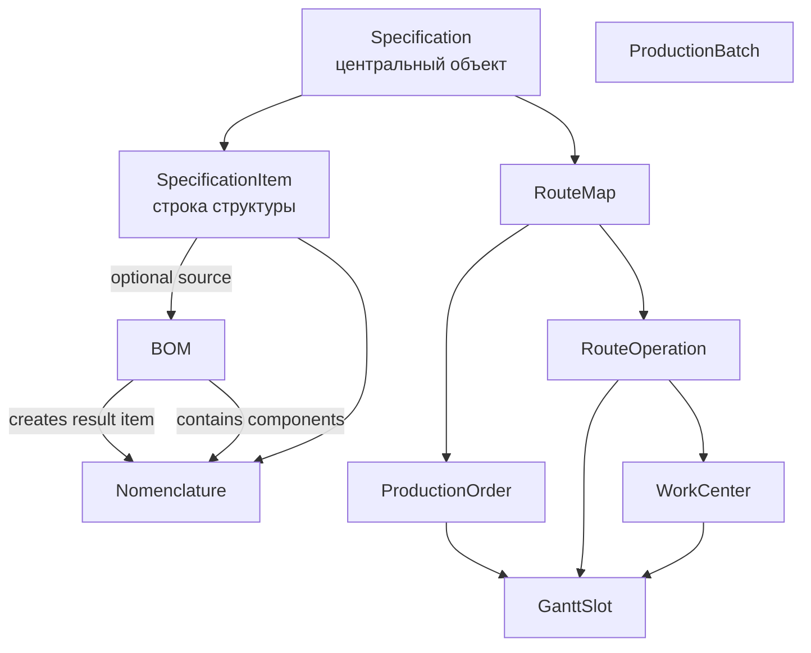

# Карта взаимосвязей объектов MES

Дата аудита: 2026-06-02  
Версия интерфейса при аудите: v.1.152  
Цель: показать фактическую карту объектов и скрытых бизнес-процессов в текущем прототипе, включая легаси-логику.

## 0. Обновление после ревизии v.1.152

Актуальная модель подтверждена по коду, а не по старым названиям модулей:

- центральный объект планирования и мониторинга - спецификация;
- отдельной пользовательской сущности "проект" в интерфейсе больше нет;
- `projectId` остается только техническим alias для `specificationId` в маршрутах, слотах Ганта и старых сохранениях localStorage;
- справочник больше не является альтернативным редактором BOM-листов и спецификаций;
- BOM-листы и спецификации редактируются только в своих модулях;
- "Карта операций" - источник вариантов операций для маршрутной карты;
- "Заказ на пр-во" - единственный штатный путь передачи маршрутной карты в Гант.

Безопасные исправления этой ревизии:

- добавлены комментарии в коде на границах legacy `projectId`;
- обновлена runtime-карта типов под спецификационно-центричную модель;
- удалены скрытые конфиги справочника для старого редактирования BOM и спецификаций;
- новый доступ к справочникам больше не предлагает устаревший раздел `projects`.

Оставлено как контролируемый legacy:

- названия функций `getProject*` и `calculateProjectProgress`;
- `planningState.projects = []` как миграционная пустая секция;
- `projectId` в сохраненных route/slot объектах;
- старые поля спецификации `bomListA`, `bomListB`, `extraItems` как производные/миграционные поля.

## 0.1 Обновление после Contract Migration v1

После ревизии сущностей введен контрактный слой `src/mes_contracts.js`. Он не меняет текущее хранилище, но задает общий язык для UI и будущей бизнес-логики.

Документные контуры:

- `routeCard` - маршрутная карта, отвечает на вопрос "как делать";
- `workOrder` - заказ-наряд, отвечает на вопрос "что, сколько и к какому сроку произвести";
- `ganttSlot` - слот планирования, отвечает за размещение операции во времени;
- `shiftWorkOrder` - сменный заказ-наряд, отвечает за работу мастера, ресурс и исполнителя;
- `dispatchFact` - факт диспетчерской, отвечает за план/факт, брак и будущую корректировку.

Ключевые переходы:

- `routeCardToWorkOrder`;
- `workOrderToGanttSlot`;
- `ganttSlotToShiftWorkOrder`;
- `shiftWorkOrderIssue`;
- `shiftWorkOrderToDispatchFact`;
- `dispatchFactToPlanningCorrection`.

Legacy-поля `projectId`, `batchId`, `planningStatus` и `status` пока остаются ради совместимости с текущими сохранениями, но новые UI-участки должны читать их через view-model и `getMesStatusView(scope, value)`.

## 1. Главный вывод

Система уже не является простой связкой "спецификация -> маршрут -> Гант". Под капотом работает несколько автоматических процессов:

- BOM создает и обновляет номенклатуру.
- Результат BOM превращается в номенклатурную позицию типа "Печатные платы".
- Спецификация может ссылаться не только на BOM, а на результат BOM через номенклатуру.
- Маршрутная карта автоматически достраивает операции из структуры спецификации.
- Заказ на производство использует маршрут как единый заказ-наряд без отдельной сущности.
- Гант автоматически создает слоты операций и складские операции.
- Старый объект "проект" удален из UI, но его роль частично выполняет виртуальный production context, построенный из спецификации.
- Поле `projectId` до сих пор используется как совместимый alias для `specificationId` во многих объектах.

Из-за этого пользователь видит простые модули, но изменение одного объекта может менять 2-5 других сущностей.

## 2. Основные хранилища

## 3. Ключевые сущности

| Сущность | Где хранится | Роль сейчас | Важные связи |
|---|---|---|---|
| Спецификация | `directoryState.specifications` | Центральный объект производства | Структура изделия, BOM, номенклатура, маршрут, заказ, Гант |
| BOM-лист | `directoryState.bomLists` | Состав печатной платы | Импортированные строки, подсчет компонентов, результат BOM как печатная плата |
| Номенклатура | `directoryState.nomenclature` | Материалы, РЭА, печатные платы, покупные/производимые позиции | Заполняется вручную и автоматически из BOM |
| Маршрутная карта | `planningState.routes` | Производственное задание/маршрут для спецификации | Ссылается на спецификацию, имеет операции |
| Операция маршрута | `planningState.routeSteps` | Технологический шаг | Участок, операция, задача спецификации, BOM, платы в мультиплате |
| Заказ-наряд | `planningState.routes` | Единица планирования для спецификации | Маршрут хранит количество, статус и правила запуска |
| Операция в Ганте | `planningState.slots` | Конкретный запланированный слот | Ссылается на маршрут, шаг маршрута, участок; `batchId` остается legacy-алиасом routeId |
| Участок | `planningState.workCenters` | Производственная мощность для Ганта | Частично пересекается со справочниками |
| Калькулятор | `calculatorState` | Расчет SMT/операций | Может создавать/перезаписывать маршрутные операции |

## 4. Текущая фактическая модель данных

## 5. Основной бизнес-процесс "как сейчас"

## 6. Подкапотные процессы по модулям

### 6.1 BOM-листы

Нормальный пользовательский сценарий:

1. Создать BOM.
2. Импортировать Excel или добавить РЭА-компоненты из номенклатуры.
3. Таблица BOM пересчитывает типоразмеры и количество компонентов.
4. BOM становится источником для калькулятора и спецификации.

Скрытая логика:

- При сохранении BOM создается/обновляется номенклатура типа "Печатные платы" как результат BOM.
- При импорте BOM каждая строка может создать/обновить номенклатуру типа "РЭА компоненты".
- Подсчет компонентов строится из `importRows`, если они есть; иначе из старых полей `c0402`, `c0603`, `cqfn` и т.д.
- При удалении BOM ссылки на него вычищаются из спецификаций и калькулятора.

Риск легаси:

- В BOM одновременно живут старая модель "счетчики компонентов" и новая модель "таблица importRows".
- Результат BOM хранится не только в BOM, но и как отдельная номенклатура.
- Спецификация может ссылаться на BOM напрямую или косвенно через номенклатуру-результат BOM.

### 6.2 Номенклатура

Нормальный сценарий:

1. Пользователь создает позицию номенклатуры.
2. Выбирает тип: РЭА компоненты, печатные платы, механика и т.д.
3. Позиция используется в BOM или спецификации.

Скрытая логика:

- Типы номенклатуры синхронизируются из существующих позиций.
- Удаление типа номенклатуры меняет тип у позиций на fallback.
- Импорт BOM может создавать РЭА-компоненты без отдельного действия пользователя.
- Создание/сохранение BOM может создавать печатную плату как результат BOM.

Риск легаси:

- Номенклатура является и мастер-данными, и производным результатом BOM.
- Пользователь может не понимать, какие позиции создал он сам, а какие сгенерированы системой.

### 6.3 Спецификации

Нормальный сценарий:

1. Создать спецификацию.
2. Добавить строки структуры: узел, номенклатура, результат BOM, другая спецификация.
3. Для производимых строк указать операцию и отдел.
4. Покупные строки не требуют операции.

Скрытая логика:

- Структура спецификации рекурсивная: спецификация может ссылаться на другую спецификацию.
- Старые поля `bomListA`, `bomListB`, `extraItems` все еще пересчитываются из новой структуры.
- Если строка спецификации указывает на номенклатуру, которая является результатом BOM, система выводит связанный BOM через `sourceBomResultId`.
- Только строки с `executionType = make` становятся задачами для маршрутной карты.

Риск легаси:

- Одновременно есть новая структура `structureItems` и старые производные поля `bomListA/bomListB`.
- Рекурсивные спецификации полезны, но могут порождать сложные маршруты и неочевидные задачи.
- Удаление номенклатуры или BOM может оставлять "желтые" или пустые ссылки в структуре.

### 6.4 Маршрутная карта

Нормальный сценарий:

1. Выбрать спецификацию.
2. Добавить операции участка или склада.
3. Передать маршрут в заказ на производство.

Скрытая логика:

- При открытии/выборе маршрута система может автоматически достроить операции из производимых строк спецификации.
- Каждая производимая строка спецификации становится задачей маршрута.
- Если задача связана с BOM, создается типовой набор: SMT, AOI, отмывка, склад.
- Если задача сборочная, создается сборка, тестирование, склад.
- Если есть операции без актуальной задачи спецификации, они становятся orphan-задачами.

Риск легаси:

- Маршрут хранится в `planningState`, а спецификация в `directoryState`.
- Маршрут все еще содержит `projectId`, хотя проекта как бизнес-сущности больше нет.
- Автодостройка операций может выглядеть как "система сама что-то добавила".

### 6.5 Заказ на производство

Нормальный сценарий:

1. Выбрать маршрутную карту.
2. Указать количество к производству.
3. Указать платы в мультиплате для печатных плат.
4. Передать в Гант.

Скрытая логика:

- Production context создается виртуально из спецификации.
- `getProject()` фактически возвращает не проект, а производственный контекст спецификации.
- Маршрут выступает единым заказ-нарядом; отдельная сущность больше не создается.
- Изменение количества маршрута может пересчитать связанные слоты.
- Платы в мультиплате хранятся в маршруте как override `planningBoardsPerPanelBySource`.

Риск легаси:

- Названия функций и поля все еще говорят `project`, но бизнес-сущность уже спецификация.
- Это главный источник путаницы: "projectId" часто означает "specificationId".

### 6.6 Гант

Нормальный сценарий:

1. Получить задания из заказа на производство.
2. Отобразить операции на временной сетке.
3. Двигать слоты, менять статус, количество.

Скрытая логика:

- Слоты создаются из операций маршрута выбранного заказ-наряда.
- Расписание ищет ближайшее свободное окно с учетом мощности участка.
- Длительность операции считается из количества, скорости участка и мультиплаты.
- Складская операция добавляется автоматически.
- Гант делит SMT на производственные линии через виртуальные workCenter-строки.
- Стрелки зависимостей строятся из порядка routeSteps внутри заказ-наряда и задачи спецификации.

Риск легаси:

- `normalizePlanningState()` может автоматически менять `routeSteps` и `slots` при обычной загрузке.
- Складской шаг и складской слот могут появиться без прямого действия пользователя.
- Слоты используют `projectId`, `specificationId`, `routeId`, `batchId` одновременно.

### 6.7 Калькулятор

Нормальный сценарий:

1. Выбрать BOM.
2. Выбрать конфигурацию SMT-линии.
3. Получить расчет длительности операции.

Скрытая логика:

- Калькулятор до сих пор хранит `routeOperations`.
- Он может сохранять расчет в маршрутную карту.
- Он читает ресурсы/компоненты/нормы из справочников.
- Удаление BOM/ресурса сбрасывает связанные поля калькулятора.

Риск легаси:

- Калькулятор начинался как модуль сборки маршрута, а теперь должен быть отдельным расчетчиком. Старые связи с маршрутами остались.

## 7. Легаси-слой "проект"

Проект как явная сущность удален из UI, но код все еще содержит:

- `planningState.projects`, которое всегда нормализуется в пустой массив.
- `projectId` в `routes`, `slots`, `bomLists`, `specifications`, `calculatorState`.
- `getProject()`, который сначала ищет legacy project, а затем возвращает production context спецификации.
- `getProjectDisplayName()`, `getProjectRouteForModule()`, `projectMatchesFilters()` и другие функции со старой терминологией.

Фактически сейчас:

Это не обязательно ломает систему, но сильно усложняет понимание и повышает риск ошибок при доработках.

## 8. Каскадные удаления

```mermaid
flowchart TB
  DEL_BOM["Удалить BOM"] --> CLEAR_CALC["Сбросить BOM в калькуляторе"]
  DEL_BOM --> CLEAR_SPEC_BOM["Убрать ссылки BOM из спецификаций"]
  DEL_BOM --> TOMBSTONE_BOM["Записать tombstone, чтобы backup не вернул BOM"]

  DEL_SPEC["Удалить спецификацию"] --> DEL_ROUTES["Удалить маршруты спецификации"]
  DEL_SPEC --> DEL_STEPS["Удалить операции маршрута"]
  DEL_SPEC --> DEL_SLOTS["Удалить слоты Ганта"]
  DEL_SPEC --> CLEAR_CALC_SPEC["Сбросить калькулятор"]
  DEL_SPEC --> TOMBSTONE_SPEC["Записать tombstone"]

  DEL_NOM["Удалить номенклатуру"] --> CLEAR_BOM_ROWS["Убрать nomenclatureId из строк BOM"]
  DEL_NOM --> CLEAR_SPEC_ROWS["Убрать nomenclatureId из строк спецификации"]

  DEL_WC["Удалить участок"] --> DEL_WC_STEPS["Удалить routeSteps участка"]
  DEL_WC --> DEL_WC_SLOTS["Удалить слоты участка"]
  DEL_WC --> CLEAR_CALC_WC["Убрать операции калькулятора этого участка"]
```

## 9. Автоматические процессы, которые пользователь может принять за баг

| Событие | Автоматический эффект | Почему может удивлять |
|---|---|---|
| Сохранить BOM | Создается номенклатура "Печатная плата" | Пользователь не создавал эту позицию вручную |
| Импортировать BOM | Создаются РЭА-компоненты | Номенклатура растет сама |
| Открыть/сохранить спецификацию | Пересчитываются `bomListA/B` | Старые поля меняются из структуры |
| Открыть маршрут | Могут добавиться операции по структуре спецификации | Маршрут "сам достраивается" |
| Передать в заказ | Может создаться production context и заказ-наряд | Нет отдельного объекта "проект", но задание появляется |
| Передать в Гант | Создаются слоты по шагам заказ-наряда | Операций становится много |
| Загрузка/нормализация planningState | Добавляется складской шаг/слот | Система сама добавляет финальную операцию |
| Удалить спецификацию | Удаляются маршруты и слоты | Каскад большой |
| Открыть через другой host/port | Данные "пропали" | localStorage разный для `localhost` и `127.0.0.1` |

## 10. Самые рискованные места

1. **Смешение `projectId` и `specificationId`**  
   Это главная легаси-проблема. Большая часть планирования все еще говорит "project", но фактически работает со спецификацией.

2. **Два состояния: `directoryState` и `planningState`**  
   Спецификации/BOM лежат в одном состоянии, маршруты/слоты в другом. Любая связь между ними требует ручной синхронизации.

3. **Автоматические мутации при нормализации**  
   `normalizePlanningState()` не только нормализует, но и добавляет складские операции/слоты и пересчитывает даты.

4. **BOM одновременно источник компонентов и производитель номенклатуры**  
   Это правильно для бизнес-логики, но сейчас нет явной маркировки "создано системой".

5. **Спецификация имеет старые и новые поля одновременно**  
   `structureItems` является новой моделью, `bomListA/B` и `extraItems` являются совместимостью.

6. **Калькулятор сохранил старую роль конструктора маршрута**  
   Он должен быть расчетчиком, но часть функций все еще умеет формировать маршрут.

7. **Удаление объектов имеет большие каскады**  
   Особенно спецификация и участок. Нужны preview удаления и журнал последствий.

8. **Есть функции от удаленных/экспериментальных модулей**  
   В коде еще видны функции дерева, snapshots/reset и часть старой терминологии. Это не обязательно доступно в UI, но усложняет сопровождение.

## 11. Рекомендуемая целевая модель

Целевой принцип:

- Спецификация отвечает на вопрос "что производим".
- BOM отвечает на вопрос "из каких РЭА состоит печатная плата".
- Номенклатура отвечает на вопрос "какие материальные объекты существуют".
- Маршрутная карта отвечает на вопрос "какими операциями производим".
- Заказ на производство отвечает на вопрос "сколько производим и по каким правилам запускаем операции".
- Гант отвечает на вопрос "когда и на каком участке выполняется".

## 12. Что чистить первым

### Приоритет 1. Зафиксировать термины

- Переименовать внутренние production-функции: `getProject` -> `getProductionContext`.
- Постепенно заменить `projectId` на `specificationId` там, где это уже точно спецификация.
- Оставить миграционный alias только на границе загрузки старых данных.

### Приоритет 2. Разделить normalize и mutate

Сейчас нормализация может добавлять складские шаги и слоты. Лучше:

- `normalizePlanningState()` только приводит типы и поля.
- `ensureWarehouseRouteSteps()` отдельная явная функция.
- `ensureWarehouseSlots()` отдельная явная функция при передаче в Гант.

### Приоритет 3. Упростить спецификацию

- Сделать `structureItems` единственным источником состава.
- `bomListA/B` оставить только как миграционные поля или убрать после миграции.
- Явно показывать строки, которые пришли из BOM-result номенклатуры.

### Приоритет 4. Развязать калькулятор и маршрут

- Калькулятор должен отдавать расчет длительности.
- Маршрут должен сам решать, использовать расчет или нет.
- Убрать старое понятие `calculatorState.routeOperations`, если оно больше не нужно.

### Приоритет 5. Ввести единый слой событий

Вместо скрытых обновлений вида "сохранил BOM -> что-то поменялось в номенклатуре":

- `BOM_SAVED`
- `BOM_IMPORTED`
- `SPECIFICATION_UPDATED`
- `ROUTE_TRANSFERRED_TO_PLANNING`
- `PLANNING_TRANSFERRED_TO_GANTT`

Так будет видно, какие сущности меняются после каждого действия.

## 13. Вывод по "сколько легаси"

Легаси-логики действительно много. Но она не хаотичная полностью: большая часть появилась как адаптеры между сменившимися центральными сущностями:

- было: проект -> BOM/спека/маршрут/Гант;
- стало: спецификация -> BOM/номенклатура/маршрут/заказ/Гант;
- код частично остался на старой терминологии `project`.

Главная проблема не в количестве модулей, а в том, что часть автоматических процессов не видна пользователю и не изолирована в отдельный слой бизнес-событий.

Перед backend/multi-user режимом лучше сначала сделать короткий cleanup:

1. Убрать или изолировать `projectId` legacy.
2. Разделить нормализацию и автоматическое создание складских операций.
3. Сделать единый data/service слой для BOM, спецификаций, маршрутов, заказов и Ганта.
4. Добавить журнал действий/изменений.

Тогда переход на общий server-state JSON будет намного безопаснее.
