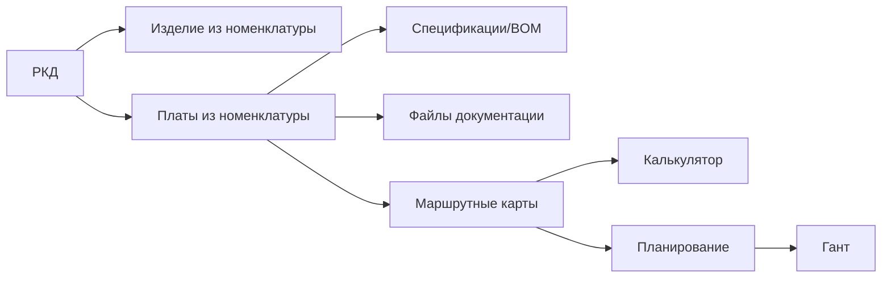

# Модуль РКД: целевая архитектура

Дата: 2026-06-05
Контекст кода: текущий прототип хранит справочники и спецификации в `directoryState`, маршруты/слоты Ганта в `planningState`, калькулятор в `calculatorState`.

## 1. Роль РКД в системе

РКД - центральный связующий производственный комплект, а не генератор данных.

Главная цепочка:

Источники истины остаются в существующих модулях:

| Данные | Источник истины | Роль РКД |
|---|---|---|
| Изделия, платы, РЭА, материалы | Номенклатура | Хранит ссылку |
| BOM / спецификация платы | Модуль BOM-листов | Хранит ссылку на выбранный BOM |
| Состав изделия | Модуль спецификаций | Может быть связан с РКД, но не копируется |
| Файлы | Существующий файловый механизм, если он есть | Хранит связь файла с РКД или платой |
| Маршруты | Маршрутные карты | Хранит/показывает связь с маршрутом |
| Производительность | Калькулятор | Показывает последний расчет по маршруту |
| Заказ-наряд и план | Планирование | Показывает готовность/связь |
| Слоты и календарь | Гант | Показывает ссылку/статус |

## 2. Что уже есть в текущем коде

Текущая фактическая модель описана в `docs/object-relationship-map.md`.

Важные наблюдения по коду:

- `renderRkdPage()` сейчас показывает линейный мастер, но отдельной сущности РКД нет.
- `directoryState.specifications` сейчас является центральным объектом производства.
- `planningState.routes`, `planningState.routeSteps`, `planningState.slots` используют `specificationId`, а `projectId` остается legacy alias.
- `getProductionContextForSpecification()` строит виртуальный production context из спецификации.
- `saveCalculatorRouteToProject()` может создать маршрутную карту, если ее еще нет.
- `schedulePlanningRouteToGantt()` создает слоты по заказ-наряду при передаче в Гант.
- `saveBomModuleForm()`, `importBomFromXlsxFile()`, `updateBomImportRows()` синхронизируют BOM с номенклатурой.
- `addSpecificationStructureItem()` сейчас может подставлять первый найденный объект номенклатуры/спецификации в новую строку. Для РКД такой подход нельзя наследовать.

Вывод: РКД нужно вводить как новый слой связей и комплектности, не ломая существующий центр производства и не копируя BOM/маршруты/расчеты.

## 3. Структура модуля

Модуль состоит из:

1. Реестр РКД.
2. Карточка РКД.
3. Состав РКД по печатным платам.
4. Связи с BOM/спецификациями.
5. Комплект файлов.
6. Технические требования.
7. Маршрутные карты по каждой плате.
8. Результаты калькулятора.
9. Готовность к планированию.
10. Связь с Гантом.
11. Проверка комплектности.
12. История изменений через существующий аудит, если он есть.

РКД не заменяет ни один модуль. Оно показывает, что уже связано, что отсутствует, и дает явные действия для выбора, загрузки или создания в профильном модуле.

## 4. Экраны и блоки интерфейса

### Реестр РКД

Колонки:

| Колонка | Источник |
|---|---|
| Номер РКД | `rkd.number` |
| Наименование | `rkd.name` |
| Изделие | ссылка `rkd.nomenclatureItemId` -> номенклатура |
| Версия/ревизия | `rkd.revision` |
| Статус | существующий механизм статусов или `rkd.status` |
| Количество плат | количество строк `rkd.boards` |
| Спецификации | связи `rkd.boards[].specificationId` |
| Маршруты | связи `rkd.boards[].routeMapId` |
| Дата создания | `rkd.createdAt` |
| Ответственный | `rkd.responsibleUserId` |
| Комплектность | результат read-only проверки |

Пустые значения:

- нет изделия -> "Изделие не выбрано";
- нет плат -> "Платы не добавлены";
- нет BOM -> "BOM не привязан";
- нет маршрута -> "Маршрут не создан";
- нет файлов -> "Файлы не загружены".

### Карточка РКД

Поля:

- номер РКД;
- наименование;
- изделие из номенклатуры;
- тип РКД, если есть справочник/enum;
- ревизия;
- заказчик, только если сущность уже поддержана;
- проект, только если сущность уже поддержана;
- ответственный;
- статус;
- комментарий.

Кнопки:

- "Создать РКД";
- "Сохранить";
- "Выбрать изделие из номенклатуры";
- "Создать изделие в номенклатуре" - только явный переход/действие пользователя;
- "Создать новую ревизию" - если включена версионность.

### Состав РКД

Строка платы:

| Поле | Правило |
|---|---|
| Плата | ссылка на существующую номенклатуру |
| Обозначение | поле связи в РКД |
| Количество в изделии | поле связи в РКД |
| BOM | ссылка на существующий BOM |
| Сторона монтажа | поле РКД или справочник, если уже есть |
| Тип монтажа | поле РКД или справочник, если уже есть |
| Файлы | связи файлов с этой строкой |
| Маршрут | ссылка на маршрут, если создан/привязан |
| Готовность | read-only статус строки |

Добавление платы:

- пользователь выбирает существующую плату из номенклатуры;
- если платы нет, показывается действие "Создать в номенклатуре";
- до выбора объект платы в базе не создается;
- draft-строка может жить только в UI-state.

### Связь с BOM

Для каждой платы:

- выбрать существующий BOM;
- отвязать BOM;
- открыть BOM;
- показать количество позиций, статус, дату изменения, ошибки, если эти данные есть в модуле BOM.

Нельзя:

- копировать `importRows` внутрь РКД;
- создавать пустой BOM при добавлении платы;
- автоматически выбирать первый BOM.

### Файлы РКД

Файл может быть связан:

- со всей РКД;
- с конкретной платой внутри РКД.

Тип файла должен приходить из существующего справочника/конфигурации. Если такого механизма нет, на первом этапе допустимо хранить простое строковое поле `fileType`, но не создавать новую сложную подсистему справочников.

Пустое состояние:

- "Файлы не загружены";
- "Gerber не загружен";
- "Pick&Place не загружен";
- "Тип файла не определен".

### Технические требования

Минимальная безопасная модель:

- текстовые поля/заметки в карточке РКД или в строке платы;
- ссылки на существующие признаки/справочники, если они уже есть.

Не заполнять значения вроде SMT, THT, AOI, отмывка, покрытие, если пользователь их не выбрал и они не пришли из существующих данных.

### Маршруты

Для каждой платы должна быть отдельная маршрутная карта, если в одной РКД несколько плат.

Действия:

- "Создать маршрут для платы";
- "Создать маршруты для всех плат";
- "Привязать существующий маршрут";
- "Открыть маршрут".

Маршрут создается только через явную команду. Открытие РКД, реестра или проверки комплектности не создает маршрут.

### Калькулятор

РКД показывает данные расчета по маршруту:

- линия оборудования;
- производительность;
- время производства;
- настройки, если доступны;
- дата расчета;
- статус расчета.

Если расчета нет: "Расчет не выполнен".

Расчет выполняется в калькуляторе, а не в РКД.

### Планирование и Гант

В планирование попадают только готовые РКД/платы, у которых выполнены обязательные условия. РКД показывает проблемы комплектности и ссылки на план/Гант, но не строит Гант самостоятельно.

## 5. Модель данных

Для текущего прототипа это может быть новый раздел `directoryState.rkdKits`. В backend-версии это отдельные таблицы/коллекции.

### `RkdKit`

| Поле | Тип | Источник/смысл |
|---|---|---|
| `id` | string | id РКД |
| `number` | string | номер РКД |
| `name` | string | наименование РКД |
| `revision` | string | ревизия |
| `status` | string | существующий статусный механизм или локальный статус РКД |
| `nomenclatureItemId` | string nullable | ссылка на изделие из номенклатуры |
| `responsibleUserId` | string nullable | ссылка на пользователя/сотрудника |
| `comment` | string | комментарий |
| `createdAt` | datetime | дата создания |
| `updatedAt` | datetime | дата изменения |

### `RkdBoardLink`

| Поле | Тип | Источник/смысл |
|---|---|---|
| `id` | string | id связи |
| `rkdId` | string | ссылка на РКД |
| `boardNomenclatureItemId` | string nullable | ссылка на плату из номенклатуры |
| `designation` | string | обозначение платы в РКД |
| `quantityInProduct` | number | количество в изделии |
| `specificationId` | string nullable | ссылка на существующий BOM/спецификацию платы |
| `routeMapId` | string nullable | ссылка на маршрутную карту |
| `mountingSide` | string nullable | сторона монтажа, если нужно хранить в РКД |
| `mountingType` | string nullable | тип монтажа, если нужно хранить в РКД |
| `sortOrder` | number | порядок строк |
| `comment` | string | комментарий |

Важно: `boardNomenclatureItemId`, `specificationId`, `routeMapId` - ссылки, не копии.

### `RkdFileLink`

| Поле | Тип | Источник/смысл |
|---|---|---|
| `id` | string | id связи |
| `rkdId` | string | ссылка на РКД |
| `boardLinkId` | string nullable | nullable: файл ко всей РКД или к плате |
| `fileId` | string | ссылка на файл в существующем файловом модуле |
| `fileType` | string | тип файла из справочника/конфигурации |
| `isActual` | boolean | актуален ли файл |
| `comment` | string | комментарий |

### View-model, не база

Такие строки не сохраняются как реальные объекты:

- пустая строка платы для формы добавления;
- "BOM не привязан";
- "Маршрут не создан";
- "Расчет не выполнен";
- "Файл не загружен";
- результат проверки комплектности.

## 6. API-контракты

Read-only endpoints без побочных эффектов:

- `GET /rkd` - список РКД.
- `GET /rkd/:id` - карточка РКД.
- `GET /rkd/:id/readiness` - проверка комплектности.
- `GET /rkd/:id/boards/:boardLinkId/calculation-summary` - данные расчета по маршруту, если есть.
- `GET /rkd/:id/history` - история через существующий аудит.

Команды с явным действием пользователя:

- `POST /rkd` - создать РКД.
- `PATCH /rkd/:id` - обновить карточку.
- `POST /rkd/:id/boards` - добавить существующую плату из номенклатуры.
- `PATCH /rkd/:id/boards/:boardLinkId` - обновить поля связи платы.
- `DELETE /rkd/:id/boards/:boardLinkId` - удалить связь платы с РКД.
- `PUT /rkd/:id/boards/:boardLinkId/specification` - привязать существующий BOM.
- `DELETE /rkd/:id/boards/:boardLinkId/specification` - отвязать BOM.
- `POST /rkd/:id/files` - привязать/загрузить файл через файловый сервис.
- `DELETE /rkd/:id/files/:fileLinkId` - удалить связь с файлом.
- `POST /rkd/:id/boards/:boardLinkId/routes` - создать маршрут для конкретной платы.
- `POST /rkd/:id/routes/create-for-all-boards` - создать маршруты для всех плат.
- `PUT /rkd/:id/boards/:boardLinkId/route` - привязать существующий маршрут.
- `PATCH /rkd/:id/status` - изменить статус с валидацией.
- `POST /rkd/:id/revisions` - создать новую ревизию, если поддержано.

Запреты:

- `GET` не создает записи.
- `readiness` не создает записи.
- view-model не создает записи.
- привязка существующей сущности не создает новую сущность.
- создание связанных объектов возможно только через command endpoint.

## 7. Правила отсутствующих данных

| Ситуация | UI | База |
|---|---|---|
| Нет изделия | "Изделие не выбрано" | `nomenclatureItemId = null/""` |
| Нет плат | "Платы не добавлены" | нет `RkdBoardLink` |
| Плата не выбрана в draft-строке | "Выберите плату" | draft только в UI |
| Нет BOM | "BOM не привязан" | `specificationId = null/""` |
| Нет маршрута | "Маршрут не создан" | `routeMapId = null/""` |
| Нет расчета | "Расчет не выполнен" | нет записи/связи расчета |
| Нет файлов | "Файлы не загружены" | нет `RkdFileLink` |
| Нет заказчика | "Не указан" или скрыть | не создавать заказчика |

## 8. Запрет мок-данных

В production-коде РКД запрещены:

- demo rows;
- тестовые РКД;
- фейковые платы;
- пустые BOM;
- пустые маршруты;
- fake file records;
- тестовые заказчики;
- тестовые линии;
- автоматический выбор первого объекта "чтобы было не пусто";
- новые классы корпусов/типоразмеров без связи с существующим справочником.

Если нужно показать будущую строку, это `draftState`, а не запись в `directoryState` или базе.

## 9. Интеграция с существующими модулями

### Номенклатура

РКД хранит только `nomenclatureItemId` и `boardNomenclatureItemId`.

Создание новой номенклатуры возможно только через явное действие в модуле номенклатуры. РКД может открыть форму создания, но не должна сохранять объект сама без подтверждения пользователя.

### Спецификации/BOM

РКД хранит только ссылку на BOM/спецификацию платы. BOM-строки и компонентный состав остаются в модуле BOM.

Существующую связь BOM -> номенклатура нужно уважать, но не запускать из read-only проверки РКД.

### Маршрутные карты

Маршрут должен ссылаться на конкретную плату/строку РКД и/или производственную спецификацию. Если текущая модель маршрута принимает только `specificationId`, нужен переходный слой: создать для каждой платы явную производственную спецификацию только по кнопке "Создать маршрут", либо расширить route entity полями `rkdId` и `rkdBoardLinkId`.

Предпочтительный вариант для новой модели:

- `route.rkdId`;
- `route.rkdBoardLinkId`;
- `route.specificationId` остается ссылкой на production/specification context, если он нужен планированию;
- `route.projectId` не использовать в новом коде кроме legacy compatibility.

### Калькулятор

Калькулятор получает маршрут/плату/BOM и сохраняет расчет в маршрутные операции. РКД только читает результат и показывает статус.

### Планирование

Планирование принимает маршруты, созданные для плат. РКД передает в планирование только готовые строки плат или показывает список блокеров.

### Гант

Гант строится из маршрутов и слотов. РКД не строит слоты. Карточка РКД может показывать ссылку на route/planning/gantt, если связь уже есть.

## 10. Проверка комплектности

Проверка read-only. Она возвращает:

- `state`: `ready`, `warning`, `blocked`;
- список проблем;
- список предупреждений;
- список возможных действий пользователя.

Минимальные проверки:

| Проверка | Ошибка |
|---|---|
| выбрано изделие | "Изделие не выбрано" |
| есть хотя бы одна плата | "Платы не добавлены" |
| у каждой платы выбрана номенклатура | "Для строки N плата не выбрана" |
| у каждой обязательной платы выбран BOM | "Для платы X BOM не привязан" |
| есть обязательные файлы | "Для РКД не загружен Gerber" |
| указаны стороны монтажа | "Для платы X сторона монтажа не указана" |
| создан маршрут | "Для платы X маршрут не создан" |
| выполнен расчет | "Для маршрута X расчет не выполнен" |

Проверка не исправляет проблемы автоматически.

## 11. Статусы и переходы

Если в системе есть общий справочник статусов, использовать его. Если нет, минимальный набор РКД-статусов хранить рядом с РКД и не дублировать другие production statuses.

Рекомендуемые статусы:

- Черновик;
- На проверке;
- Требует доработки;
- Готово к маршрутизации;
- Маршруты созданы;
- Готово к планированию;
- В производстве;
- Завершено;
- Архив.

Переходы валидируются проверкой комплектности. При ошибке система показывает список проблем, но ничего не создает.

## 12. Версии и ревизии

Минимальная безопасная модель:

- `RkdKit` хранит `revision`;
- критичные связи относятся к конкретной ревизии;
- новая ревизия создается только по явной кнопке;
- если РКД уже использовалось в производстве, критичные изменения требуют новой ревизии;
- история старой ревизии не перетирается.

Не строить сложную PLM-подсистему до появления реальных требований к согласованию, ECO/ECN и заморозке данных.

## 13. Acceptance criteria

РКД считается реализованным корректно, если:

- РКД использует существующую номенклатуру, а не копирует ее.
- Платы внутри РКД являются ссылками на существующие позиции номенклатуры.
- РКД использует существующие BOM/спецификации, а не хранит копии BOM.
- Если данных нет, интерфейс показывает пустое состояние.
- Открытие карточки РКД не создает записи.
- Проверка комплектности не создает записи.
- Отсутствующие файлы не создают fake file records.
- Отсутствующие маршруты не создают пустые маршруты.
- Маршрут создается только после явной команды пользователя.
- BOM привязывается только после явного выбора пользователя.
- Новая номенклатура создается только через явное действие пользователя.
- В коде нет hardcoded mock rows.
- В production-коде нет demo-данных.
- Нет дублирования бизнес-логики BOM, маршрутов, калькулятора, планирования и Ганта.
- Используются существующие сервисы, компоненты, справочники и паттерны проекта.
- Read-only операции не имеют side effects.
- Для каждой платы в РКД можно создать или привязать отдельную маршрутную карту.
- РКД показывает готовность к маршрутизации, расчету и планированию.
- РКД не подменяет калькулятор, планирование и Гант.

## 14. Риски и запрет дублирования логики

### Риск 1. РКД станет второй спецификацией

Нельзя переносить структуру BOM или `structureItems` внутрь РКД. РКД хранит связи и комплектность.

### Риск 2. Автосоздание из старых модулей протечет в РКД

Текущие функции `ensureRouteBatches()`, `saveCalculatorRouteToProject()`, `upsertBomResultToNomenclature()` имеют допустимые побочные эффекты в своих сценариях. РКД не должна вызывать такие функции из рендера, GET, проверки комплектности или построения view-model.

### Риск 3. Первый найденный объект станет "дефолтом"

Нельзя автоматически выбирать первый BOM, первую плату, первую спецификацию, первый маршрут или первую линию. В UI показывать "Не выбрано".

### Риск 4. Размытие `projectId`

Новый код РКД должен говорить на языке `rkdId`, `rkdBoardLinkId`, `specificationId`, `routeId`. `projectId` использовать только как legacy alias там, где этого требует старый код.

### Риск 5. Файловая подсистема будет продублирована

Если есть существующий файловый механизм, РКД должна хранить `fileId`, а не собственные бинарные данные и не второй способ загрузки.

### Риск 6. Справочники будут захардкожены

Типы файлов, статусы, типы монтажа, стороны, требования, пользователи, заказчики и проекты должны приходить из существующих справочников/API/конфигурации. Если справочника нет, поле остается простым и незаполненным до явного решения.

## 15. Рекомендуемый план переработки

1. Зафиксировать data contract РКД и добавить нормализацию `rkdKits` без сидов и без дефолтных записей.
2. Переделать `renderRkdPage()` из мастера процесса в реестр + карточку выбранной РКД.
3. Добавить read-only view-model комплектности.
4. Добавить явные команды: создать РКД, выбрать изделие, добавить существующую плату, привязать BOM, привязать файл.
5. Добавить явное создание/привязку маршрута для конкретной платы.
6. Подключить отображение результата калькулятора по маршруту.
7. Подключить статус планирования и Ганта только как чтение существующих маршрутов/слотов.
8. Покрыть smoke-тестами: открытие РКД, проверка комплектности, пустые состояния, отсутствие side effects.
