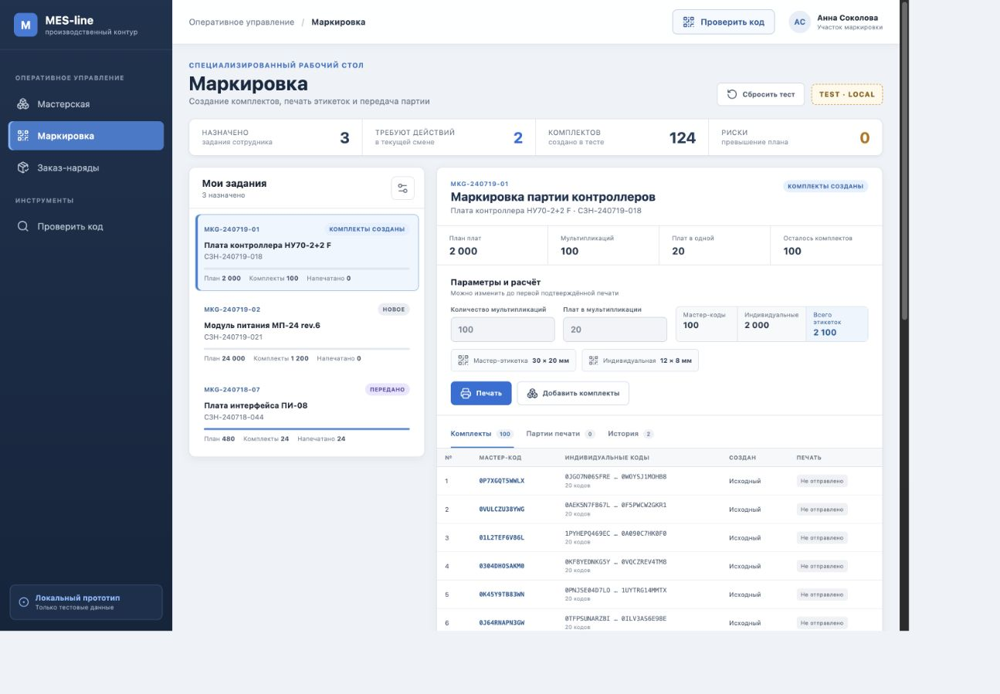
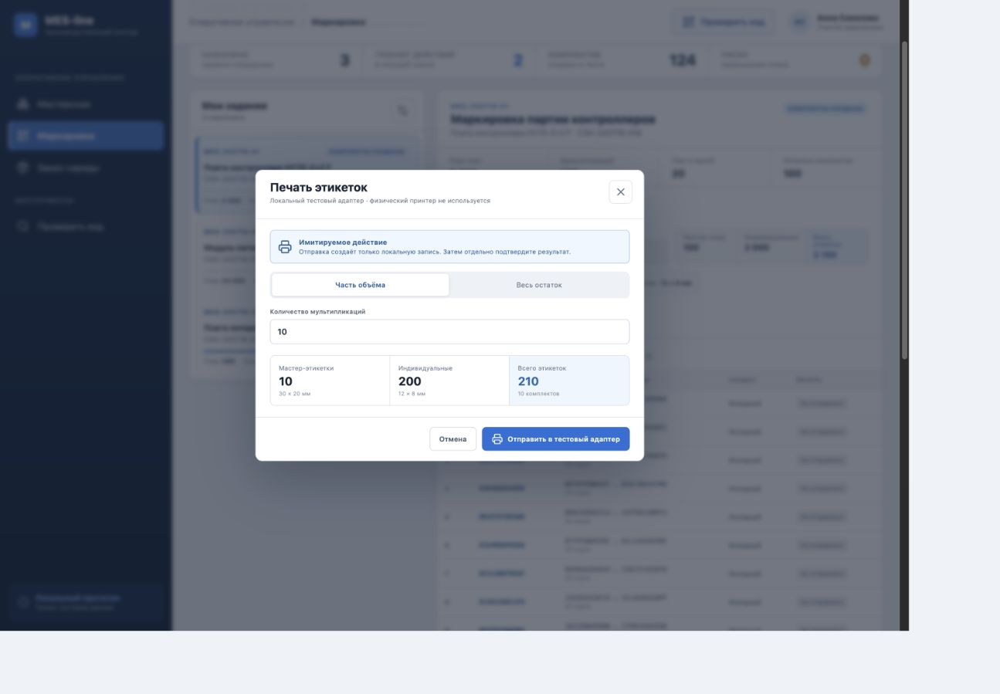
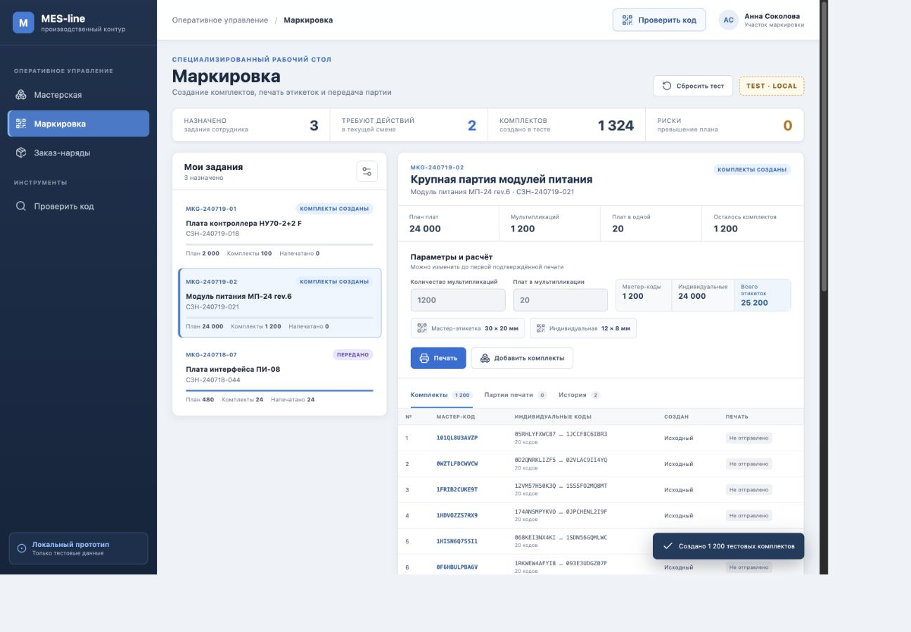
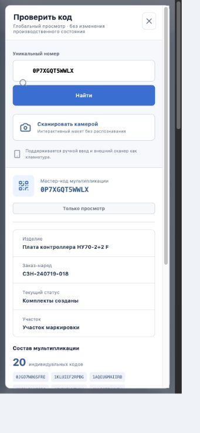
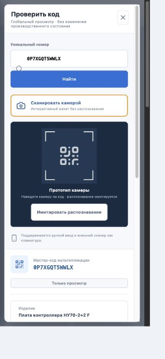

# Отчёт для визуальной оценки · Marking Phase 1

Дата проверки: 19.07.2026  
Ветка: `codex/marking-phase-1`  
Worktree: `/Users/vladislav/Documents/Codex/2026-05-30/mes-marking-phase-1`

## Где добавлено

Вся реализация, собственные зависимости, тесты, отчёт и скриншоты находятся только в:

`experiments/marking-phase-1/`

Корневой runtime MES, `src/app.js`, PostgreSQL, API, авторизация, Shift Execution, release-скрипты, корневые package-файлы и `experiments/react-migration` не изменялись.

## Что смотреть визуально

### 1. Рабочий стол маркировки

- Слева — компактная навигация MES-line и явная отметка локального прототипа.
- В центре — доска назначенных заданий со статусом, планом, комплектами и печатью.
- Справа — выбранное задание, параметры, расчёт кодов, размеры этикеток и основные действия.
- Комплекты показаны таблицей по 25 строк; тысячи кодов не выводятся одним списком.

### 2. Частичная и массовая печать

- До отправки видны размеры и количество мастер/индивидуальных этикеток.
- Есть режимы «Часть объёма» и «Весь остаток».
- После отправки требуется отдельный результат: «Печать выполнена» или «Ошибка печати».
- В истории партии доступны перепечать партии, одной мультипликации, мастер-кода и индивидуального кода; идентификаторы не меняются.

### 3. Крупный объём

- Проверено 1 200 мультипликаций, 24 000 индивидуальных кодов, 25 200 этикеток.
- Создание в браузере: около 267 мс на контрольном проходе.
- В DOM остаётся 25 строк, доступно 48 страниц; ширина страницы равна viewport, горизонтального overflow нет.

### 4. Мобильный глобальный scanner

- Ручной ввод, внешний scanner-as-keyboard и read-only карточка кода.
- Для мастер-кода показаны изделие, СЗН, статус, участок, состав и история.
- На проверенном мобильном viewport ширина диалога укладывается в экран без горизонтального overflow.

- Камера визуально отделена как прототип.
- «Имитировать распознавание» подставляет тестовый код, не запрашивает разрешение камеры и не вызывает устройство.

## Рабочий UI

- Доска трёх назначенных тестовых заданий и выбор задания.
- Настройка количества до генерации, расчёт мастер-кодов, индивидуальных кодов и этикеток.
- Детерминированная генерация непрозрачных уникальных идентификаторов.
- Постраничный список комплектов (25 строк).
- Полная и частичная печать, состояния ожидания, успеха и ошибки.
- Перепечать без создания новых идентификаторов: партия / мультипликация / мастер / плата.
- Дополнительные комплекты после запуска и неблокирующее предупреждение о превышении плана.
- Подтверждение завершения маркировки, передачи и отмены передачи с журналом.
- Глобальный поиск мастер-кода или индивидуального кода в режиме просмотра.
- Сохранение и сброс тестового состояния в браузере.

## Имитируемые действия

- Отправка на принтер и ответ оборудования.
- Физическое нанесение этикеток.
- Передача партии между участками.
- Камерное распознавание QR/штрихкода.
- Серверное хранение, глобальная MES-уникальность и права доступа.
- Производственный маршрут, дефекты, ремонты и контроль: в scanner показаны только read-only placeholders для будущей фазы.

## Переиспользованные понятия MES

Переиспользованы существующие продуктовые сущности и терминология: сотрудник, рабочий участок, изделие, сменный заказ-наряд, назначенное задание, плановое количество, «Мастерская», следующий участок и журнал операций. Реальные записи не читаются и не копируются: это тестовые проекции, намеренно изолированные от текущих adapters/storage/API.

## Пройденные проверки

- `npm run test`: 4/4 model-теста.
- `npm run build`: TypeScript + Vite production build.
- `git diff --check`: без whitespace-ошибок.
- Browser desktop: доска, карточка, расчёт, размеры этикеток, частичная успешная печать, ошибка печати, повторная печать, дополнительные комплекты, превышение плана, завершение, передача, scanner.
- Browser mobile: scanner-карточка и camera prototype.
- Large volume: 1 200 × 20, 25 строк в DOM, 48 страниц, без горизонтального overflow.
- Browser console: 0 ошибок после финального прохода.

## Допущения и открытые вопросы

- Размеры этикеток зафиксированы тестовыми значениями 30 × 20 мм и 12 × 8 мм.
- Разное количество плат в группах одного задания не реализовано; модель комплектов не запрещает добавить группы позднее.
- Окончательная модель производственных сканирований и транзитных статусов сознательно не проектировалась.
- Производственная интеграция, реальная камера, printer protocol, API, БД и права — отдельная фаза.

Известных визуальных дефектов после desktop/mobile прохода не осталось.
